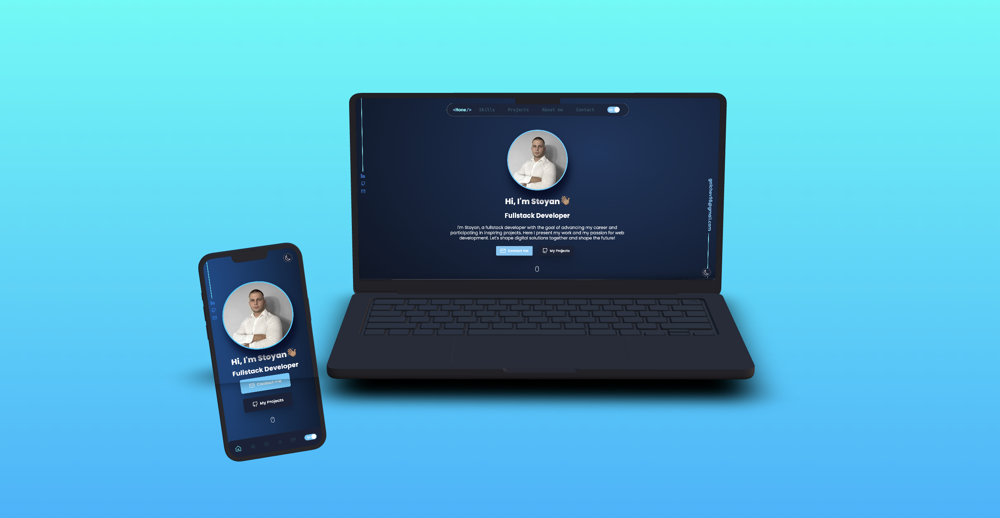

# 🚀 Portfolio Website

This is a portfolio website built using **React**, **Tailwind CSS**, and **TypeScript**.

## 🎉 Demo



You can also check out the live demo of the portfolio website [Click this link](https://stoyan-galchev.onrender.com/).

## 🌟 Features

- 🔍 **SEO optimized**
- 💾 **User settings stored in session storage**
- 🌗 **Dark and Light mode available**
- 🔧 **Easy data modification through a single `data.tsx` file**
- ⚡ **Gzipped and lazy-loaded data**
- 📱 **Compatible with all mobile devices with a beautiful and pleasant user interface**
- 🌐 **Smooth scrolling in each section, with animations when scrolling**
- 🟢 **Uptime Service with colored animation**

## 🛠️ Installation

Clone the Repo

```bash
  git clone <reponame>
```

Install dependencies

```bash
npm i or npm install
```

Start the server

```bash
npm run dev
```

## 🧰 Tech Stack

**Client:**  
- ⚛️ React
- 🧭 React Router Dom
- 🎨 Tailwind CSS
- ⌨️ Typescript
- 📡 Axios
- ✨ Prism React Renderer
- 🎉 React Icons
- 👀 React Intersection Observer
- 🔔 React Toastify
- 💬 React Tooltip
- 🎈 Reactjs Popup
- 🚀 Swiper
- 🗜️ Rollup Plugin Gzip

---

If you find this project helpful or would like to support my work, please ⭐ this Repo!

---

This version should add more visual appeal and a bit of fun to your GitHub README!
